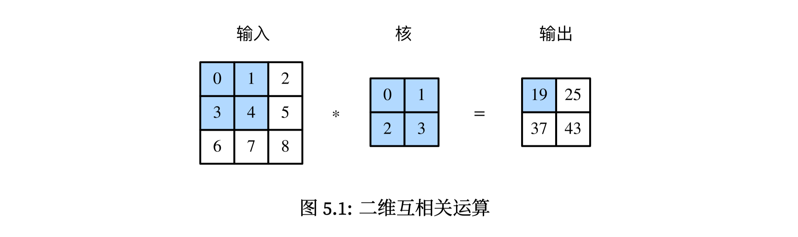
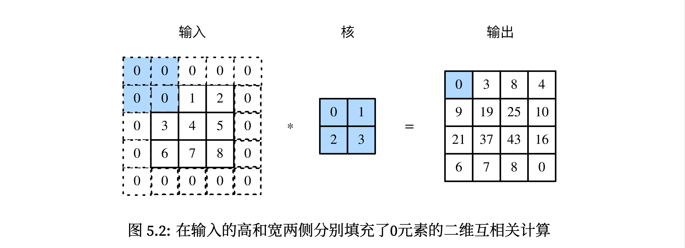
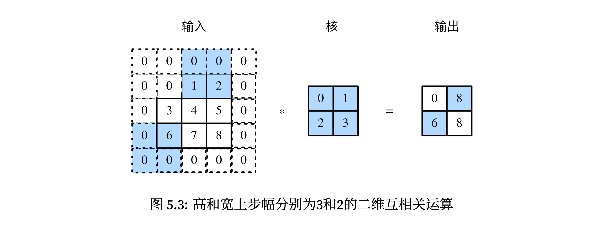

# 
layout: post
title: 卷积神经网络
toc: true
cover: /img/cover/why-is-binary.png
tags: []
category: d2l

# 卷积神经网络

## 1. 二维卷积层

>  卷积神经网络(convolutional neural network)是包含有卷积层的神经网络, 最常见的二维卷积层,有宽和高两个空间维度,常用来处理图像数据. 

### 1.1 二维互相运算关系

相互关系(cross-corrlelation)运算: 一个二维数组和一个二维核(kernel) 数组通过互相关系运算输出一个二维数组





在上图中, 输入是一个长和宽均为3的二维数组, **核**数组的高和宽分别2(称为卷积核或者过滤器). 卷积窗口的形状取决于卷积核的高和宽, 即2 x 2 .  

**二维相互关系运算:**  

卷积窗口重最左上方开始, 按照从左到右, 从上到下的顺序, 依次在**输入数组**上滑动. 当卷积窗口滑动到某一位置时, 窗口的**输入子数组**与**核数组**相乘并求和,得到输出数组中对应位置的元素. 

**上图的二维相关运算得出:**

$ 0 \times 0 + 1 \times 1 + 3 \times 2 + 4 \times 3 = 19 $

$$1 \times 0 + 2 \times 1 + 4 \times 2 + 5 \times 3 = 25  $$

$$3 \times 0 + 4 \times 1 + 6  \times 2 + 7 \times 3 = 37$$

$$4 \times 0 + 5 \times 1 + 7 \times 2 + 8 \times 3 = 43$$


实现方法`corr2d` :

```python
 # 接受输入数组X 与核数组 K, 输出数组Y
from mxnet import autograd, nd
from mxnet.gluon import nn

def corr2d(X, K):
    h, w = K.shape
    Y = nd.zeros((X.shape[0] - h + 1, X.shape[1] - w + 1))
    for i in range(Y.shape[0]):
        for j in range(Y.shape[1]):
            Y[i, j] = (X[i:i + h, j:j + w] * K).sum()
    return Y


if __name__ == '__main__':
    X = nd.array([[0, 1, 2], [3, 4, 5], [6, 7, 8]])
    K = nd.array([[0, 1], [2, 3]])
    Y = corr2d(X, K)
    print(Y)
```

### 1.2 二维卷积层

二维卷积层将**输入**和**卷积核**做互相关运算, 并加上一个**标量偏差**得到输出. 

**卷积层的模型参数:**

1. 卷积核
2. 标量偏差

通常先对卷积核随机初始化,然后不断迭代卷积核和偏差. 

基于corr2d函数 实现一个自定义的二维卷积层.  在构造函数`__init_`里声明weight和bias两个模型参数, 向前计算函数forward之间调用corr2d函数 再 加上偏差. 

```python
class Conv2D(nn.Block):
    def __init__(self, kernel_size, **kwargs):
        super(Conv2D, self).__init__(kwargs)
        self.weight = self.params.get('weight', shape=kernel_size)
        self.bias = self.params.get('bias', shape=(1,))

    def forward(self, X):
        return corr2d(X, self.weight.data()) + self.bias.data()
```


### 1.3 图像中物体边缘检测

卷积层的一个简单应用是用来检测图像中物体的边缘, 即找到 **像素变化的位置** 

**实现步骤:**

1. 首先构造一个 $$6 \times 8$$ 的图像, 中间4列为黑(0) 其余为白(1) 

    ```python
    X = nd.ones(shape=(6, 8))
    X[:, 2:6] = 0
    ```

    **输出:**

    ```
    [[1. 1. 0. 0. 0. 0. 1. 1.]
     [1. 1. 0. 0. 0. 0. 1. 1.]
     [1. 1. 0. 0. 0. 0. 1. 1.]
     [1. 1. 0. 0. 0. 0. 1. 1.]
     [1. 1. 0. 0. 0. 0. 1. 1.]
     [1. 1. 0. 0. 0. 0. 1. 1.]] 
    ```

    

2. 构造一个高和宽分别为1和2的卷积和K, 与图像数组做互相关运算, 如果横向相邻元素相同输出为0 否则输出为非0; 

    ```python
    K = nd.array([[1, -1]])
    Y = corr2d(X, K)
    ```

    **输出:**

    ```
    [[ 0.  1.  0.  0.  0. -1.  0.]
     [ 0.  1.  0.  0.  0. -1.  0.]
     [ 0.  1.  0.  0.  0. -1.  0.]
     [ 0.  1.  0.  0.  0. -1.  0.]
     [ 0.  1.  0.  0.  0. -1.  0.]
     [ 0.  1.  0.  0.  0. -1.  0.]]
    ```

    

**由此可以看出, 卷积层可以重复使用卷积核有效表征局部空间**

### 1.4 通过数据学习核数组

使用物体的边缘检测中的**输入数据X**和**输出数据Y**来学习够着的**核数组K**. 

**步骤:**

1. 先构造一个卷积层,将卷积核初始化为随机数组
2. 在每次迭代中,使用平方误差比较Y和卷积层的输出.
3. 计算梯度更新权重

> 这里的卷积层忽略偏差

```python
# 二维卷积层使用4维输出, 格式为(样本数, 通道, 高, 宽)
# 这里的 批量大小(批量中的样本数) 通道数均为1
X = X.reshape(1, 1, 6, 8)
Y = Y.reshape(1, 1, 6, 7)

for i in range(20):
    with autograd.record():
        Y_hat = conv2d(X)
        l = (Y_hat - Y) ** 2
    l.backward()
    # 忽略偏差
    conv2d.weight.data()[:] -= 3e-2 * conv2d.weight.grad()

    if (i + 1) % 2 == 0:
        print("batch : %d, loss: %.3f" % (i + 1, l.sum().asscalar()))
print(conv2d.weight.data().reshape((1, 2)))
```

**输出:**

```
<NDArray 6x8 @cpu(0)>
batch : 2, loss: 4.949
batch : 4, loss: 0.831
batch : 6, loss: 0.140
batch : 8, loss: 0.024
batch : 10, loss: 0.004

[[ 0.9895    -0.9873705]]
<NDArray 1x2 @cpu(0)>
```

由结果可以看出和之前定义的核数组K较接近


### 1.5 互相关系运算和卷积运算

**卷积运算**与与互相关系运算类似, 是将和数组**左右翻转并上下翻转,**再与数组做互相运算.  

在深度学习中核数组都是学习出来的, 卷积层屋里使用互相关运算或卷积运算都不影响模型预测时的输出 .


### 1.6 特征图和感受野

**特征图(feature map):** 二维卷积层输出的二维数组可以看做输入在空间维度(宽和高)上某一级的表征.

**感受野(receptive field):**  影响元素$x$的向前计算的所有可能输入区域(可能大于输入的实际尺寸) 叫做$x$的感受野. 


在图5.1中 输入中阴影部分的四个元素是输出中阴影部分元素的感受野.  


将输出的形状为$2 \times 2$记为$Y$ , 并考虑一个更深的卷积神经网络, 将 $Y$ 与另一个形状为$2 \times2$的核数组做互相关运算, 输出单个元素$z$ , 那么 $z$ 的**感受野**包括$Y$的全部4个元素.  在输入上的干搜也包括其中全部9个元素. 


**可以通过更深的卷积神经网络使特征图的单个元素的感受野变得更加广阔, 从而捕获更大尺寸的特征**


##2. 填充和步幅

使用高和宽为3的输入和高和宽为2的卷积核得到高和宽2的输出.  假设 输入的形状为 $n_h \times n_w$ 卷积和的窗口形状为: $k_h \times \ k_w$ 输出的形状为: 

$$
(h_h - k_h + 1) \times (n_w - k_w + 1)
$$

### 2.1 填充(padding)

输入高和宽两侧填充元素(通常为0)

 


图5.2里在原输入的高和宽的两侧分别添加了值为0的元素, 使得输入高和宽从3变成5, 导致输出高和宽有2增加到4 .  


如果在高的两侧填充$p_h$行, 在宽的两侧填充$p_w$行,输出的形状为: 
$$
(n_h - k_h + p_h + 1) \times (n_w - k_w + p_w + 1)
$$


输出的高和宽会分别增加$p_h$和$p_w$


在很多情况下,会设置$p_h = k_h - 1$ 和 $p_w = k_w - 1$ 来使得输入和输出具有相同的高和宽.  这样会方便在构造网络是推测每个层的输出形状. 

- $k_h$为奇数时, 会在高的两侧分别填充$p_h/2$ 行

- $k_h$为偶数时, 在输入的顶端一侧通常$[p_h/2]$(向上取整), 在底端一侧填充$[p_h/2]$(向下取整)

宽的两侧填充同理

 

```python
# 定义一个函数计算卷积层, 初始化卷积层权重, 并对输入和输出进行相应的升维和降维
def comp_conv2d(conv2d, X):
    conv2d.initialize()

    # 添加前两维批量和通道
    X = X.reshape((1, 1) + X.shape)
    Y = conv2d(X)

    # 排除不关心的前两维 批量和通道
    return Y.reshape(Y.shape[2:])


if __name__ == '__main__':
    # 两侧分别填充1行或者列
    conv2d = nn.Conv2D(1, kernel_size=3, padding=1)
    X = nd.random.uniform(shape=(8, 8))
    Y = comp_conv2d(conv2d, X)
    print(Y.shape)
```

输出:

```
(8, 8)
```

当卷积核的高和宽不同时,可用通过设置高和宽不同的填充使输出和输入具有相同的高和宽. 

```python
X = nd.random.uniform(shape=(8, 8))
conv2d = nn.Conv2D(1, kernel_size=(5, 3), padding=(2, 1))
Y = comp_conv2d(conv2d, X)
print(Y.shape)
```

输出:

```
(8, 8)
```

### 2.2 步幅(stride)


二维互相关运算是卷积窗口从输入数组的最左上方开始, 按照从左到右, 从上到下, 依次在输入数组上滑动, 将每次滑动的行数和列数称为 **步幅(stride)**




图5.3中展示了,在高上步幅为3, 在宽上步幅为2的二维互相关运行.  

图书阴影部分的计算:
$$
0 \times 0 + 0 \times 1 + 1 \times 2 + 2  \times 3 = 8 
$$

$$
0 \times 0 + 6 \times 1 + 0 \times 2 + 0 \times 3 = 6
$$


当高上的部分为$s_h$ 宽上步幅为$s_w$时 输出为:
$$
\lfloor (n_h - k_h + p_h + s_h) / s_h \rfloor \times \lfloor (n_w - k_w + p_w + s_w) / s_w  \rfloor
$$


如果$p_h = k_h - 1 $ 和 $p_w = k_w - 1$ 则输出的形状为:


$$
\lfloor (n_h  + s_h - 1) / s_h \rfloor \times \lfloor (n_w + s_w - 1) / s_w  \rfloor
$$


如果 输入的高和宽能被高和宽上的步幅整除, 输出的形状为:
$$
(n_h ) / s_h  \times  (n_w) / s_w
$$


代码实例:

```python
X = nd.random.uniform(shape=(8, 8))
conv2d = nn.Conv2D(1, kernel_size=3, padding=1, strides=2)
Y = comp_conv2d(conv2d, X)
print(Y.shape)
```

输出:

```
(4, 4)
```

```python 
X = nd.random.uniform(shape=(8, 8))
conv2d = nn.Conv2D(1, kernel_size=(3, 5), padding=(0, 1), strides=(3, 4))
Y = comp_conv2d(conv2d, X)
print(Y.shape)
```

输出:

```
(2, 2)
```


**填充可以增加输出的高和宽, 通常用来使输出和输入具有相同的高和宽 **

**步幅可以减少输出的宽和高, 输出的高和宽仅为传入的高和宽的$1/n$(n为大于1 的正整数)**


## 3. 多输入通道和多输出通道


前面的例子用到的输入和输出都是二维数组, 真实的数据纬度经常更高.   彩色图像在高和宽两个纬度外还有RGB 3个颜色通道. 假设 彩色图像的高和宽分别为$h$和$w$, 图像可以表示成一个 $3 \times  h \times w$的多维数组. 将大小3的这一维称为通道(channel)


### 1. 多输入通道


